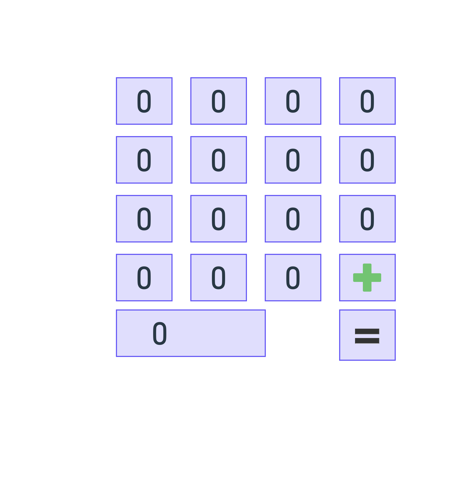

# CalculatorProject
This is my calculator I'm building along with SEV9.

# MVP
*Minimum Viable Product*

- Calculator Interface
- Functionality
  - Add
  - Subtract
  - Multiply
  - Divide
  - Clear

[Basic Example](https://kellykraymond.github.io/Calculator/)

# PMVP
*Post Minimum Viable Product*

  - Whatever You want
    - but maybe
      - Modes
      - Neumorphism
        - https://codepen.io/nxworld/pen/OJVJQme
      - Animate

[Advanced Example](https://dancruznyc.github.io/multicalculator/)

# Wireframes

Insert Your Image Here

# License

[MIT](https://choosealicense.com/licenses/mit/)